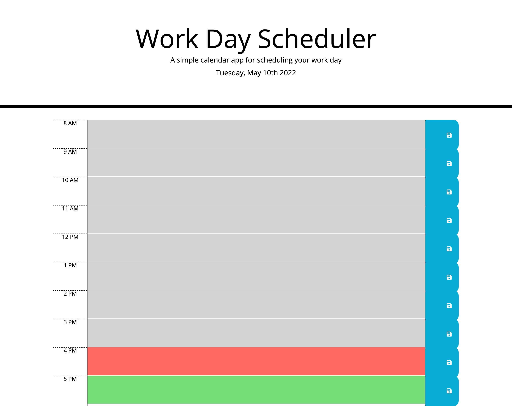

# 5-day-planner

In this project I have used HTML as the baseline layout, styled it with CSS and used Jquery for JavaScript commands and made it user interactive to record the events in the local storage for the user to view and store on the calender for each hour. highlight the current time in red and future time in green to make it easier for the user to add events according and less room for errors

Below is the screenshot of the webpage and The live link to the website: https://mohamedisaaq0.github.io/5-day-planner/

